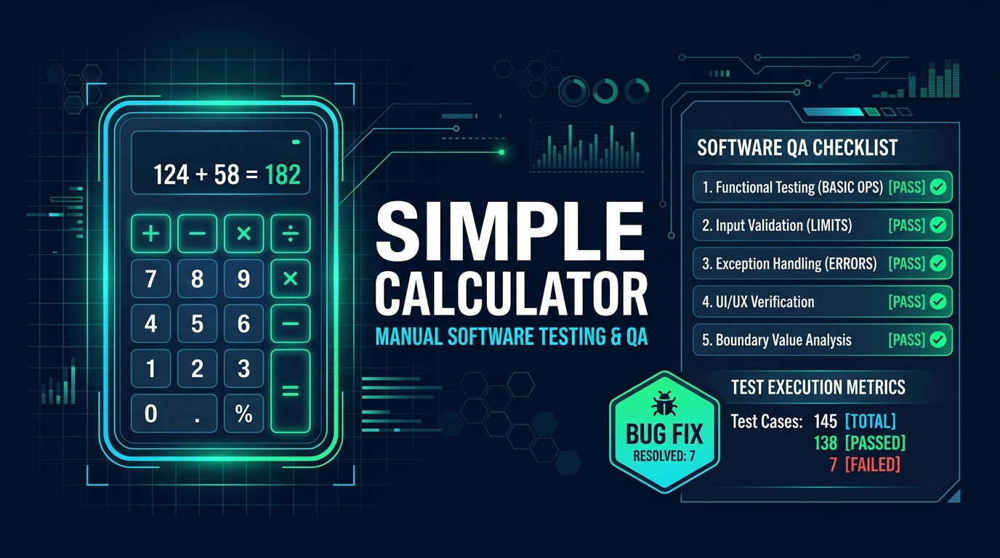

<div align="center">



# Simple Calculator Application - Manual Testing & Version Upgrading

An interactive, menu-driven calculator developed in Python for the **Learning Manual Testing** course activity at **The Open University of Sri Lanka (OUSL)**.

[](https://github.com/numair-it/simple-calculator)
[](https://github.com/numair-it/simple-calculator/releases)
[](https://github.com/numair-it/simple-calculator)
[](https://github.com/numair-it/simple-calculator)

<p align="center">
  <b>GitHub Repository:</b> <a href="https://github.com/numair-it/simple-calculator">https://github.com/numair-it/simple-calculator</a><br>
  <b>Author / Student:</b> numair-it (numairking4712@gmail.com)<br>
  <b>Activity Due Date:</b> 28.09.2026 | <b>Version:</b> v2.0.0
</p>

</div>

---

## 📌 Project Overview
This project demonstrates the complete **Manual Software Testing Lifecycle (STLC)**:
1. **Initial Development (v1.0.0)**: Baseline implementation of basic arithmetic functions.
2. **Test Case Design**: Formulated 20 black-box manual test scenarios utilizing Boundary Value Analysis (BVA), Equivalence Partitioning (EP), and Error Guessing.
3. **Initial Test Execution & Defect Reporting**: Executed tests against `v1.0.0`. Identified and documented 5 critical and high-severity defects.
4. **Defect Fixing & Version Upgrade (v2.0.0)**: Refactored codebase, implemented defensive input validation, handled mathematical edge cases, and re-executed regression tests.
5. **Final Test Execution**: 100% test pass rate achieved in `v2.0.0`.

---

## 📊 Test Execution Summary

| Metric | Version 1.0.0 (Initial) | Version 2.0.0 (Upgraded) | Improvement / Status |
| :--- | :---: | :---: | :---: |
| **Total Test Cases** | 20 | 20 | 100% Test Coverage |
| **Passed Test Cases** | 15 | 20 | +5 Test Cases Passed |
| **Failed Test Cases** | 5 | 0 | 0 Open Defects |
| **Pass Percentage** | **75.0%** | **100.0%** | **+25.0% Quality Improvement** |
| **Defects Detected** | 5 | 0 Open | All 5 Defects Fixed & Closed |
| **Stability** | 5 Unhandled Crashes | Zero Crashes | Robust Error Handling |

---

## 🐛 Defect Tracking Log (Bugs Fixed in v2.0.0)

| Defect ID | Related Test Case | Severity | Priority | Description | Resolution in v2.0.0 | Status |
| :--- | :--- | :---: | :---: | :--- | :--- | :---: |
| **BUG-001** | `TC_CALC_012` | Critical | High | Division by zero caused unhandled `ZeroDivisionError` crash | Added denominator validation; returns `"Error: Division by zero is not allowed."` | **CLOSED** |
| **BUG-002** | `TC_CALC_014` | High | High | Modulus by zero caused unhandled `ZeroDivisionError` crash | Added divisor validation; returns `"Error: Modulo by zero is not allowed."` | **CLOSED** |
| **BUG-003** | `TC_CALC_018` | High | Medium | Square root of negative number caused unhandled `ValueError` crash | Added validation for negative numbers; returns `"Error: Cannot calculate square root of a negative number."` | **CLOSED** |
| **BUG-004** | `TC_CALC_019` | Medium | High | Alphabetic/string input caused immediate `ValueError` crash | Implemented `get_valid_number()` helper with `try-except` loop and user-friendly error prompt | **CLOSED** |
| **BUG-005** | `TC_CALC_020` | Medium | Medium | Empty/blank input caused unhandled `ValueError` crash | Added `.strip()` and empty check before type conversion; re-prompts user | **CLOSED** |

---

## 📁 Repository Structure
```
ousl/
├── calculator.py                                # Main calculator application (v2.0.0)
├── test_calculator.py                           # Automated test suite mirroring test cases
├── generate_excel.py                            # Script generating the formatted Excel sheet
├── Manual_Testing_Test_Cases_Calculator.xlsx     # Official Manual Testing Excel workbook
├── README.md                                    # Project documentation & test report
└── .gitignore                                   # Git ignore file
```

---

## 🚀 How to Run

### 1. Run the Interactive Calculator
```bash
python calculator.py
```

### 2. Run the Test Verification Suite
```bash
python test_calculator.py
```

---

## 📑 Excel Test Scenarios Document
The official Excel file for activity submission is:
**`Manual_Testing_Test_Cases_Calculator.xlsx`**

It contains:
- **Sheet 1 (`Test Summary & Overview`)**: Complete summary metrics, project details, and GitHub repository URL.
- **Sheet 2 (`Manual Test Cases`)**: All 20 detailed test cases with Pre-conditions, Steps, Inputs, Expected vs Actual Results for both v1.0.0 and v2.0.0.
- **Sheet 3 (`Defect Log (Bugs)`)**: Bug tracking log with Severity, Priority, Steps to Reproduce, and Resolution details.
